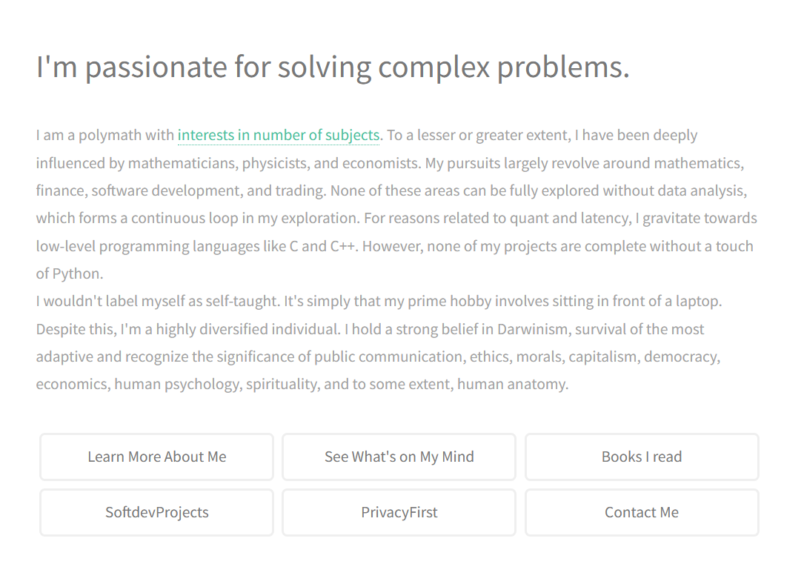

***MY REPOSITORIES ARE NOT PUBLIC <= FY25***
***[Read More about my current private project](https://1darshanpatil.github.io/blog/privacyFolds/crudeprivacy.html)***

    $ whoam -i
    Python is my passion, but I also use code for mathematics. Its extensive libraries have helped me to visualize data
    and make calculations a breeze. I love spending my time trying to find the direction of stock and commodity futures
    by deciphering previous patterns, news, the global market, and the global supply chain. I'm always up for a challenge,
    and I'm always looking for new ways to use code to solve problems.
