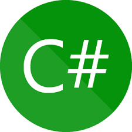
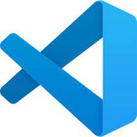

## Getting to the personal part:

-I love Python and its extensive libraries have been helping me visualizing data and making calculations a lot easier. I sometimes spend my time finding direction of stocks and commodities futures attempting to decipher the previous patterns, news, global market, and global supply chain.

## Languages and Tools  

